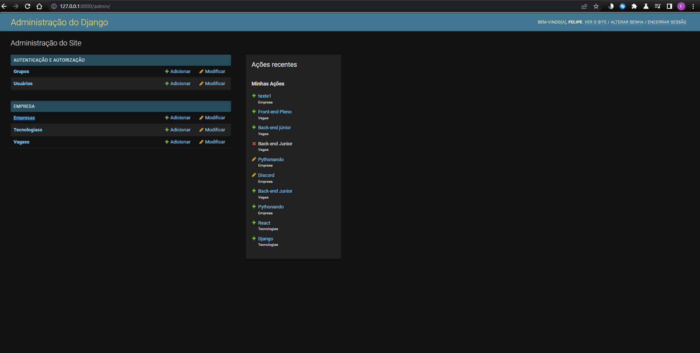
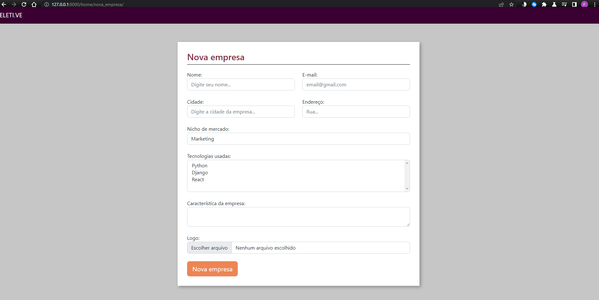
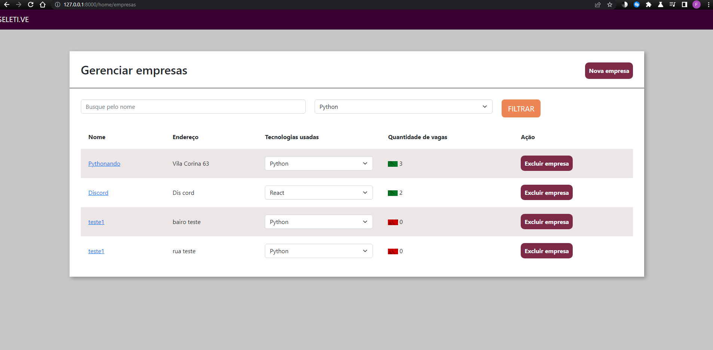
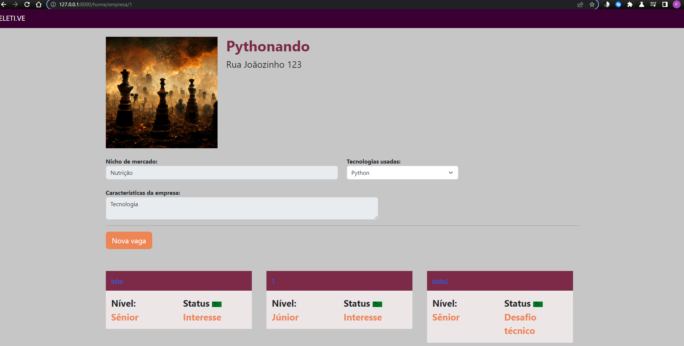
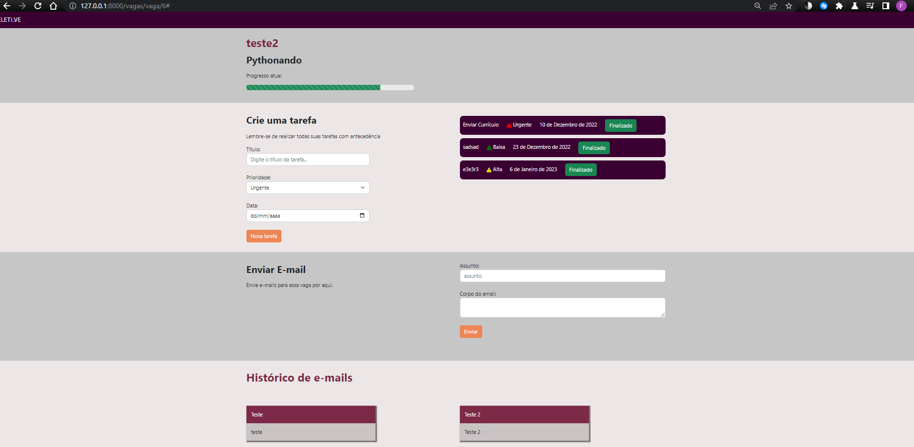

# GerenciadorDeProcessosSeletivos

## Origem
Foi desenvolvida com auxílio de video-aulas disponibilizadas pelo canal de youtube Pythonando

## Sobre o app
É uma aplicação completa, com o objetivo de facilitar o gerenciamento de processos seletivos do usuário. O banco de dados utilizado foi o próprio do Django, DB.SQLITE

## Iniciando o app
### Virtual enviroment (venv)
#### Crie o venv: 
- py -m venv %HOMEPATH%\.virtualenvs\nomeVenv
#### Selecione o venv no VSCode: 
- Ctrl+Shift+P Python: Select Interpreter
#### Ative o venv: 
- %HOMEPATH%\.virtualenvs\nomeVenv\Scripts\activate.bat
### Dependencias
#### Dentro do venv, instale: 
- pip install django,
- pip install pillow,
- python.exe -m pip install -U autopep8
### RUN SERVER
#### Ligue o servidor na pasta seletive:
- python manage.py runserver
#### Links:
- http://127.0.0.1:8000/admin/
- http://127.0.0.1:8000/home/nova_empresa/
- http://127.0.0.1:8000/home/empresas
- http://127.0.0.1:8000/home/empresa/1
- http://127.0.0.1:8000/vagas/vaga/6#

## Prints
<h3>Area administrativa</h3>

<h3>Cadastro de empresa</h3>

<h3>Lista de empresas</h3>

<h3>Informações empresa</h3>

<h3>Barra de progresso, lista de tarefas, envio de e-mail e histórico de emails</h3>

 
